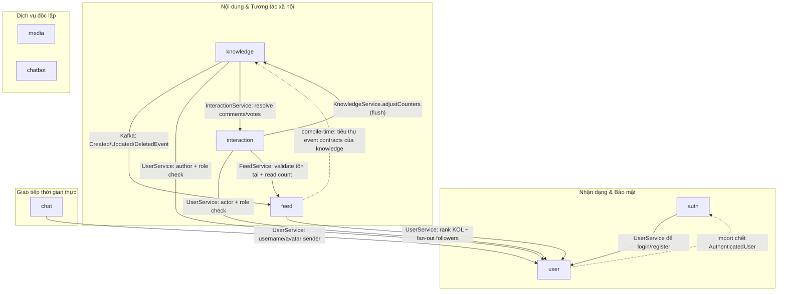

# Phân tích quan hệ phụ thuộc giữa các Module

> Backend: `edushare-backend` — package `com.nbh.edushare.modules`
> Phạm vi: `auth`, `user`, `chat`, `knowledge`, `feed`, `interaction`, `media`, `chatbot`
> Cách phân tích: quét toàn bộ import xuyên module (cross-package) + kiểm tra bean injection trong Service/Controller.

---

## 1. Sơ đồ phụ thuộc (Mermaid)

**Note quan trọng về cạnh `K <-> I` và `K -> F`:**

- `K -> F`: là luồng **runtime qua Kafka** (knowledge publish, feed consume). Về mặt compile-time, mã nguồn của `feed` **import** các event class của `knowledge` nên cạnh code là `F -. knowledge`. Không có vòng lặp vì `knowledge` KHÔNG import `feed`.
- `K -> I` và `I -> K`: đây là vòng lặp cấp package, nhưng **KHÔNG phải** vòng lặp bean injection (xem phân tích mục 3).

---

## 2. Bảng tóm tắt quan hệ phụ thuộc

| Module nguồn | Phụ thuộc vào | Mục đích / Điểm tương tác chính |
|---|---|---|
| `auth` | `user` | `CustomUserDetailsService` gọi `UserService.findByUsernameOrEmail()` khi đăng nhập; `AuthServiceImpl` gọi `UserService` để tạo user khi register và trả về `UserAuthInfo`/`UserSimpleResponse`; `AuthenticatedUser`/`TokenPayload` bọc `UserAuthInfo` thành Spring Security principal + JWT claims. |
| `chat` | `user` | `ChatMessageListener`/`ChatMessageBuilder` gọi `UserService.findProjectedById()` lấy `UserBaseProjection` (id, username, avatarUrl) để ghi tác giả tin nhắn và validate user tồn tại. |
| `feed` | `knowledge` | `KnowledgeFeedListener` (Kafka) nhận `KnowledgeCreated/Updated/DeletedEvent` → `FeedProjectionService` dựng/đồng bộ/xóa `FeedItem`; `FeedMapper` map event → projection (mô hình CQRS/materialized view). |
| `feed` | `user` | `FeedServiceImpl` gọi `UserService.findFamousFolloweeIds()`/`findNormalFolloweeIds()` để xếp hạng feed KOL thường; `FeedProjectionServiceImpl` gọi `UserService.getFollowerIds()` để fan-out `UserFeed`. |
| `interaction` | `feed` | `InteractionServiceImpl` gọi `FeedService.findProjectedById()`/`existsByKnowledgeId()` để validate bài viết tồn tại, đọc `FeedCountProjection`; `CounterServiceImpl` gọi `feedService.adjustCounters()` để đồng bộ counter sang bảng đọc. |
| `interaction` | `knowledge` | `CounterServiceImpl` gọi `KnowledgeService.adjustCounters()` để flush counter Redis → bảng gốc `knowledge`; `InteractionServiceImpl` dùng `KnowledgeErrorCode.KNOWLEDGE_NOT_FOUND` cho exception. |
| `interaction` | `user` | `UserService.findProjectedById()` lấy `UserAuthInfo` để check role ADMIN, `UserBaseProjection` cho thông tin tác giả comment trong `CommentMapper`. |
| `knowledge` | `interaction` | `KnowledgeGraphQLController` inject `InteractionService` để resolve field `Knowledge.comments` và `Knowledge.currentUserVote` qua `@SchemaMapping`. |
| `knowledge` | `user` | `KnowledgeServiceImpl` dùng `UserService` kiểm tra role/author; `KnowledgeDetailResponse`/`QuestionDetailResponse` nhúng thông tin author; `KnowledgeEventMapper` lấy owner info để tạo event. |
| `user` | `auth` | `FollowController` import `auth.security.AuthenticatedUser` — đây là **import chết** (không được sử dụng trong class). |
| `media` | — | Leaf module: upload file lên Cloudinary, không import module nào khác. |
| `chatbot` | — | Leaf module: gọi RAG/LLM bên ngoài, không import module nào khác. |

---

## 3. Phân tích thiết kế

### 3.1. Vòng phụ thuộc (Circular Dependency)

**Không có vòng phụ thuộc bean (Spring không bị lỗi `BeanCurrentlyInCreationException`),** nhưng tồn tại 2 vòng lặp cấp package cần chú ý:

| Vòng lặp | Bản chất | Mức độ rủi ro |
|---|---|---|
| `auth ↔ user` | `auth -> user` mạnh (dùng `UserService` thật sự); `user -> auth` chỉ là 1 import chết trong `FollowController` | Thấp — chỉ cần xóa import thừa là hết vòng lặp |
| `interaction ↔ knowledge` | `knowledge -> interaction` qua `KnowledgeGraphQLController` inject `InteractionService`; `interaction -> knowledge` qua `CounterServiceImpl` inject `KnowledgeService` | **Không phải vòng lặp bean thật sự**: các bean `InteractionServiceImpl`, `CounterServiceImpl`, `KnowledgeGraphQLController`, `KnowledgeServiceImpl` không tạo thành chu trình inject. Nhưng coupling business là thật |

Hướng sự kiện `knowledge -> feed` (qua Kafka) là chuẩn mực — knowledge không import feed nên không hình thành vòng.

### 3.2. Điểm gắn kết chặt (Tight Coupling) & gợi ý tối ưu

#### 1. `interaction` đang làm "bộ điều phối counter" cho 2 hệ thống khác
`CounterServiceImpl` nhúng **cả** `KnowledgeService` và `FeedService` để flush cùng một bộ counter sang 2 nơi. Vi phạm luật "ai sở hữu dữ liệu thì người đó tự cập nhật".

- **Gợi ý:** `interaction` chỉ nên publish counter event (`CommentChangedEvent`, `VoteChangedEvent`, `ViewRecordedEvent`) qua `ApplicationEventPublisher` (đã làm) và **tách hẳn việc flush** ra ngoài `interaction`:
  - Đặt flush trong một listener riêng (vd package `common.counter` hoặc 2 listener riêng cho `knowledge` và `feed`).
  - Hoặc để `knowledge` và `feed` tự lắng nghe các counter event và tự cập nhật chỉ số — interaction chỉ publish, không inject service của ai cả.

#### 2. `user` là core domain bị phụ thuộc bởi 6 module
`user` (qua `UserService` + projections) được `auth`, `chat`, `feed`, `interaction`, `knowledge` dùng. Đây là coupling hợp lý (user là aggregation root), nhưng cần **ổn định API**:

- **Gợi ý:** Tách interface `UserService` + các DTO projection (`UserBaseProjection`, `UserAuthInfo`, `UserSimpleResponse`) sang một package contract chung (vd `modules.user.api` hoặc `common.user`). Các module khác chỉ phụ thuộc vào contract, không phụ thuộc impl. Tránh `UserService` phình thêm quá nhiều method mỗi lần một module mới cần data.

#### 3. `knowledge` inject sâu vào `interaction` ở tầng controller
`KnowledgeGraphQLController` phải biết `InteractionService` + 4 class DTO của interaction chỉ để resolve comment/vote.

- **Gợi ý:** Nếu dự án phình thêm nhiều SchemaMapping chéo, nên đưa các resolver ở tầng GraphQL vào một package facade riêng (vd `graphql.facade`) đứng giữa các module — `knowledge` chỉ khai báo schema, không inject trực tiếp service của module khác. Với quy mô hiện tại (chỉ 2 field) thì có thể giữ nguyên.

#### 4. `user` cần tránh phụ thuộc ngược lên `auth`
- **Gợi ý:** Xóa import chết `AuthenticatedUser` ở `FollowController`. Về lâu dài, nếu `user` cần lấy thông tin principal/security, hãy chuyển các kiểu chung (`AuthenticatedUser`, cơ chế đọc `@AuthenticationPrincipal`) thành contract dùng chung trong `common.security` để cả `auth` và `user` cùng phụ thuộc một chiều vào `common`.

#### 5. Điểm tốt nên giữ nguyên
- **CQRS qua Kafka `knowledge -> feed`**: tách rõ write side (knowledge) và read side (feed), không vòng lặp.
- **`media` và `chatbot` là leaf module hoàn toàn độc lập** — nếu tách thành microservice/package riêng thì rất dễ dàng.